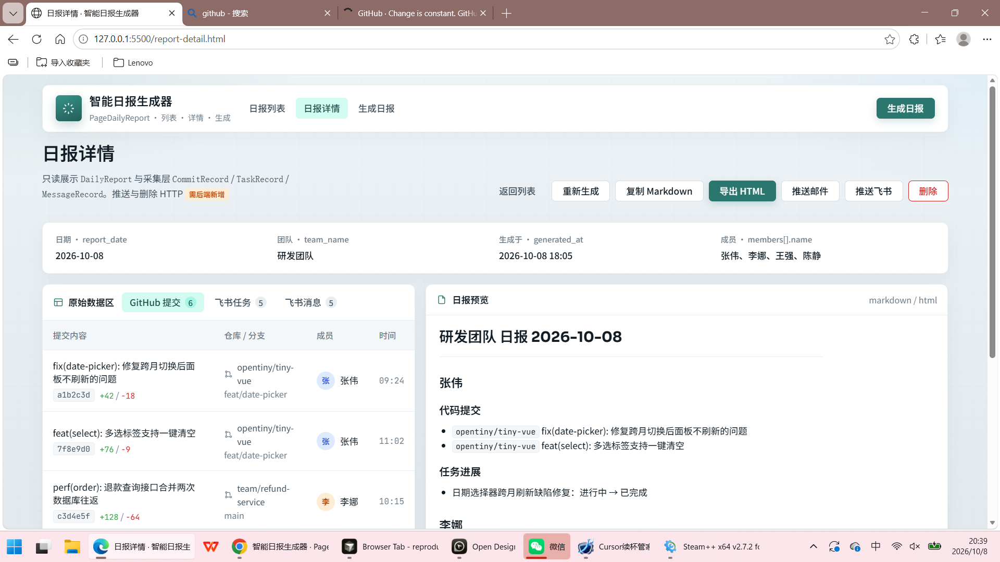

# 智能日报生成器

从 GitHub / 飞书自动采集工作数据，生成结构化日报并推送。

## 快速开始

```bash
# 安装依赖
uv sync

# 复制并填写配置
cp config.yaml.example config.yaml
```

## 项目结构

```
collector/   # 采集层
generator/   # 生成层
notifier/    # 推送层
shared/      # 共享基础层
tests/       # 测试
```
# PageDailyReport 智能日报生成器
## 启动步骤
1. 启动后端：python main.py （端口5000）
2. 启动前端：npm install 、npm run dev （端口5173）
3. 浏览器访问 http://localhost:5173
4. 填写日期、姓名，点击刷新生成日报


